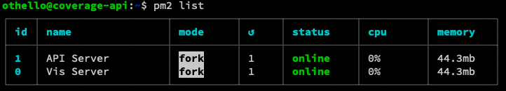

# ccn-coverage-vis

Visualizations of coverage and performance analysis for Community Cellular Networks.

Now hosted on https://coverage.seattlecommunitynetwork.org/


## Initial Setup
To install this service, the fist time, you will need to:

1. Required tools and versions:
    1. Install `node` and `npm` according to the directions at https://nodejs.org/en/download/package-manager 
2. Clone the service: `https://github.com/Local-Connectivity-Lab/ccn-coverage-vis` 
3. Configure:
    1. `cd cd ccn-coverage-vis`     
    1. Edit `src/utils/config.ts` and set the correct URL for your API host (if you're testing or you're deploying to a new URL).


## Deploying
Once the service has been setup (as above), it can be deployed using the following process:
1. Login to the coverage-host
2. Pull the lastest version from github
3. Restart the service

The shell commands are:
```
ssh coverage-host
cd ccn-coverage-vis
git pull
npm install
npm run build
pm2 restart Vis Server 
```

## Troubleshooting & Recovery
When a problem occurs, there are several checks to determine where the failure is:
1. Check HTTP errors in the browser
1. Login to the coverage-host
2. Confirm ccn-coverage-vis is operating as expected
3. Confirm nginx is operating as expected

### Checking HTTP errors in the browser
First, open your browser and go to: https://coverage.seattlecommunitynetwork.org/

Is it working?

If not, open up the browser **Web Developer Tools**, usually under the menu Tools > Developer Tools > Web Developer Tools.

With this panel open at the bottom of the screen select the **Network** tab and refresh the browser page.

Look in the first column, Status:
* `200`: OK, everything is good.
* `502`: Error with the backend services (behind nginx)
* `500` errors: problem with nxginx. Look in `/var/log/nginx/error.log` for details.
* `400` errors: problem with the service. Check the service logs and nginx logs.
* Timeout or unreachable error: Something is broken in the network between your web browser and the coverage-vis host.


### Checking ccn-coverage-vis with pm2
Next, confirm ccn-coverage-vis is operating as expected. To do this, you will need to be able to log into the server hosting the coverage service.

Use `pm2 list` to confirm the "Vis Server" is **online**
```
ssh coverage-host
pm2 list
```


If the "Vis Server" is not online as expected, restart it with:
```
pm2 restart Vis Server
```


### Checking nginx
If there appear problems with nginx, then check that the 

Check service operation:
```
systemctl status nginx
```

Check nginx logs:
```
sudo tail /var/log/nginx/error.log
```

Sources of errors might include nginx configuration in `/etc/nginx/conf.d/01-ccn-coverage.conf`

If you need to restart nginx, use: 
```
sudo systemctl restart nginx
```

### Clean Recovery
If nothing else works, the last option is a clean reinstall of the service. The process is:
* Remove the `ccn-coverage-vis` directory.
* Re-install as per **Initial Setup**.


## Testing

Changes to the main branch are automically built and deployed to: https://seattlecommunitynetwork.org/ccn-coverage-vis/

Once changes have been validated, they can be deployed with:

```
ssh coverage-api.westus2.cloudapp.azure.com
cd ccn-coverage-vis/
git switch main
git stash
git pull
npm install
```


# Issues

- Chart doesn't show tooltips.

# TODOs

- Toggle graph view off results in no toggle-on button
- Make the chart more informative
  - Hover on a line should show the exact data and which sites are they from
- Admin Panel
  - Edit Button
  - Toggle Active
- Better compatibility with local development

